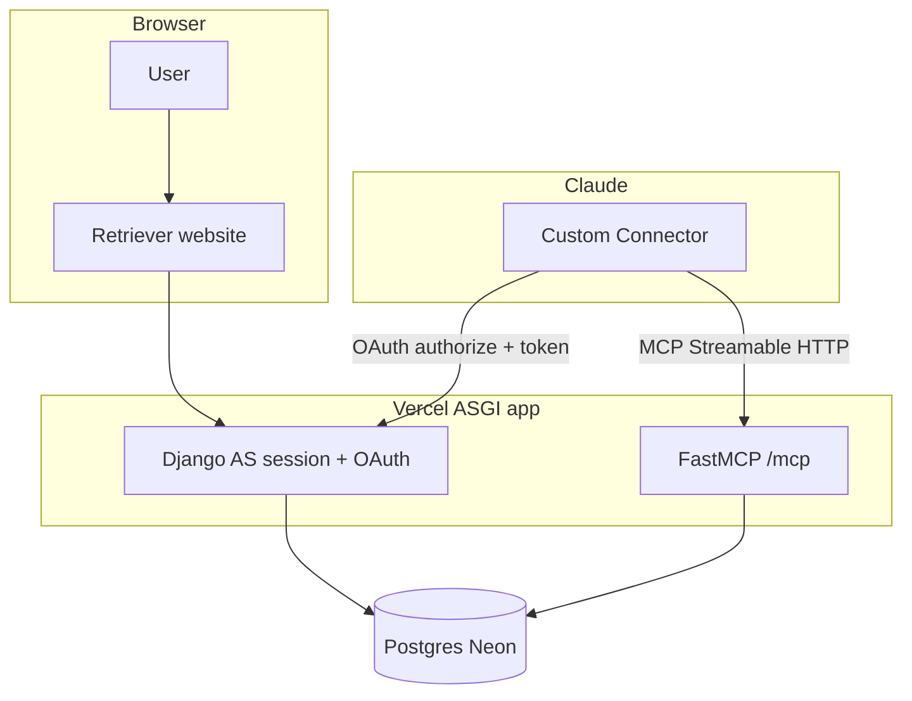
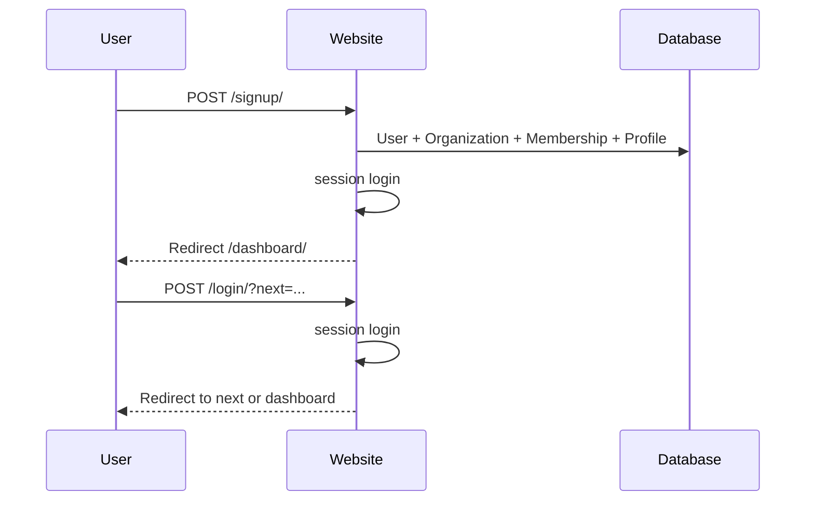
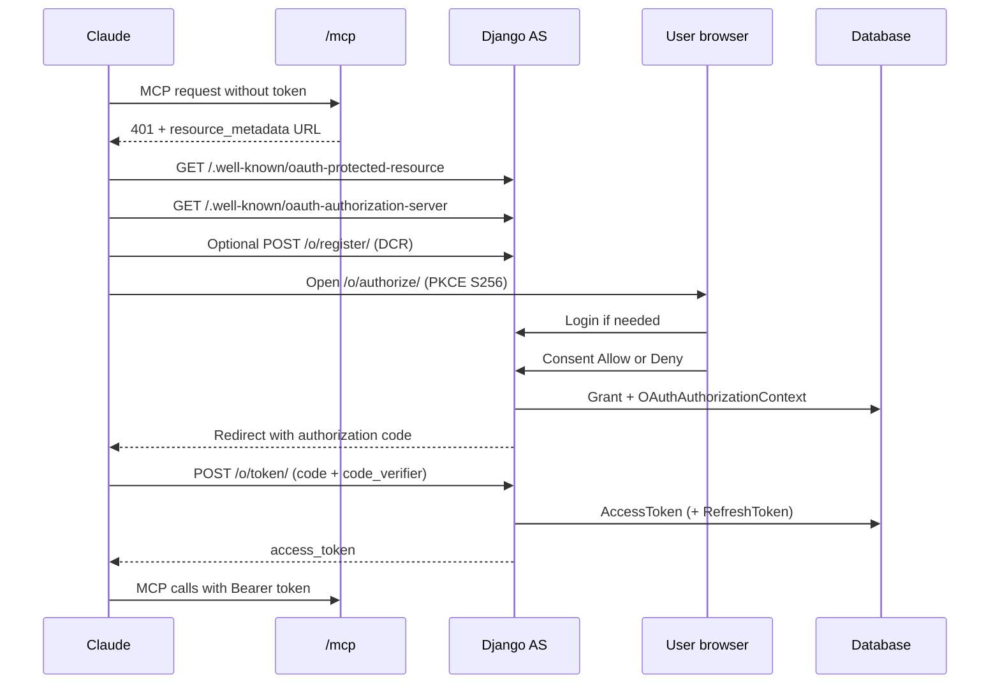
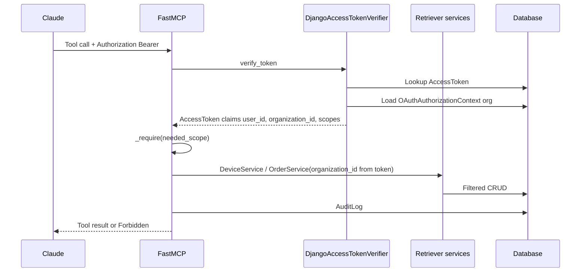
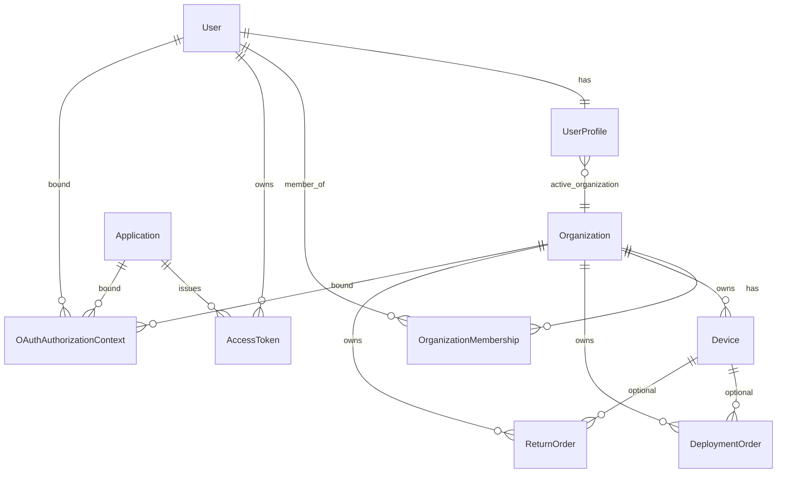
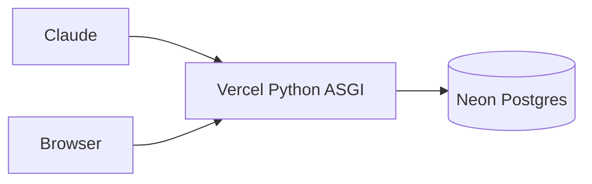

# Retriever MCP OAuth Demo — Technical Guide

This document explains **how the system works end-to-end**: architecture, request flows, data model, permissions, deployment, and security. It is written so engineers and product folks can understand the design without reading every file first.

For setup commands and Claude connector steps, see [README.md](README.md).

---

## 1. What this application is

Retriever MCP Demo is a **small but production-shaped** example of:

1. A **Retriever website** where users sign up, sign in, manage devices/orders, and control connected apps.
2. An **OAuth 2.1 Authorization Server** (login + consent) that Claude uses to get access.
3. An **MCP Resource Server** (`/mcp`) that exposes tools Claude can call with a Bearer token.

**Important design choice:** Claude never uses a shared API key. Every tool call is tied to a **real user**, an **organization**, and **scopes** granted at consent (and editable later).

---

## 2. Big picture — who does what

| Role | Plain English | Implementation |
|------|----------------|----------------|
| **Website user** | Signs in with username/password | Django session cookies |
| **Authorization Server (AS)** | Asks “Allow Claude?” and issues tokens | Django + django-oauth-toolkit |
| **Resource Server (RS)** | Runs MCP tools if the token is valid | FastMCP at `/mcp` |
| **Claude** | MCP client / Custom Connector | External product |
| **Database** | Users, orgs, devices, orders, OAuth tokens | Neon Postgres (prod) or SQLite (local) |



### Two different “logins”

| Channel | Auth mechanism | Used for |
|---------|----------------|----------|
| Browser | Django **session** + CSRF | Dashboard, devices/orders CRUD, Connected Apps, consent UI |
| Claude | OAuth **Bearer access token** | MCP tool calls |

Logging out of the website **revokes OAuth tokens**, so Claude stops working until the user reconnects. That is intentional.

---

## 3. How traffic is routed (ASGI)

Entrypoint: [`config/asgi.py`](config/asgi.py)

```text
HTTPS request
    │
    ├─ path starts with /mcp  →  FastMCP (Resource Server)
    │                              + 401 challenge middleware
    │
    └─ everything else        →  Django
                                 (pages, OAuth, discovery, admin)
```

Helpers:

- **`NormalizeMcpPath`** — treats `/mcp` like `/mcp/`.
- **`ResourceMetadataChallengeMiddleware`** — on MCP `401`, adds  
  `WWW-Authenticate: Bearer resource_metadata="https://…/.well-known/oauth-protected-resource"`.

MCP is configured for **serverless**:

- `stateless_http=True` — no long-lived MCP session process
- `json_response=True` — JSON responses (safer on Vercel than SSE)

---

## 4. Repository map

```text
config/                 Django project settings, ASGI, root URLs
accounts/               Signup, login, logout, dashboard
organizations/          Organizations, memberships, active org
oauth_server/           Discovery, consent override, DCR, Connected Apps
mcp_server/             FastMCP server, token verifier, tools
retriever/              Devices/orders models, services, web CRUD, seed
frontend/               Vite React shell (auth still owned by Django)
templates/              HTML for website + consent
static/                 CSS and built frontend assets
tests/                  Extra ASGI/MCP tests
```

| Package | Responsibility |
|---------|----------------|
| `accounts` | Session identity for humans |
| `organizations` | Multi-tenant org + “active organization” |
| `oauth_server` | OAuth UX and metadata for Claude |
| `mcp_server` | Tool surface Claude calls |
| `retriever` | Business data + shared service layer |

**Shared rule:** Web views and MCP tools both call [`retriever/services/__init__.py`](retriever/services/__init__.py). Business logic stays out of views/tools.

---

## 5. Core concepts

### 5.1 Organization (tenant)

Every device and order belongs to an **Organization**.

- On signup, a user gets an org and becomes **owner**.
- `UserProfile.active_organization` is the org used for web UI and for OAuth consent binding.
- Users can switch org via the organization UI when they belong to more than one.

### 5.2 OAuthAuthorizationContext

Stored in [`oauth_server/models.py`](oauth_server/models.py).

When the user clicks **Allow** on consent, Retriever records:

- which **user**
- which **organization** (active org at that moment)
- which **application** (Claude client)
- which **scopes**

Later, when Claude calls MCP, the token verifier loads this context so tools know the org **without trusting Claude’s arguments**.

### 5.3 Opaque access tokens

Tokens are **django-oauth-toolkit** strings stored in Postgres. FastMCP verifies them **in-process via ORM** ([`mcp_server/auth.py`](mcp_server/auth.py) → `DjangoAccessTokenVerifier`). No HTTP call back to an introspection endpoint (important on Vercel cold starts).

---

## 6. End-to-end flows

### 6.1 Signup and login



Files: [`accounts/views.py`](accounts/views.py), [`accounts/forms.py`](accounts/forms.py).

`next=` is critical: during Claude connect, login must return to `/o/authorize/…` with the original OAuth query string (client_id, PKCE, redirect_uri, etc.).

---

### 6.2 Claude connects (OAuth + consent)

This is the heart of the demo.



**Consent UI:** [`templates/oauth2_provider/authorize.html`](templates/oauth2_provider/authorize.html)  
**View:** `RetrieverAuthorizationView` in [`oauth_server/views.py`](oauth_server/views.py)

**Approval prompt**

| Setting | Behavior |
|---------|----------|
| `OAUTH_REQUEST_APPROVAL_PROMPT=auto` (default) | Skip consent if user already authorized same client + scopes (faster reconnect) |
| `force` | Always show Allow screen |

**Auth codes** expire after **300 seconds** by default (longer than 60s to survive Vercel/Neon cold starts).

**DCR** (`POST /o/register/`): Claude can register a public client automatically. Retriever always also allows:

- `https://claude.ai/api/mcp/auth_callback`
- `https://claude.com/api/mcp/auth_callback`

---

### 6.3 MCP tool call



**Tenant safety:** tools accept an optional `organization_id` argument for model compatibility, but **ignore it**. Org always comes from the token.

---

### 6.4 Website CRUD (devices and orders)

Logged-in users manage inventory in the browser:

| Area | URLs | Backend |
|------|------|---------|
| Devices | `/devices/`, `/devices/new/`, `…/edit/`, `…/delete/` | `DeviceService` |
| Orders | `/orders/`, deployment & return create/edit/delete | `OrderService` |

- Auth: Django session + CSRF  
- Tenant: active organization only  
- **OAuth scopes do not apply** to the website (the human is already logged in)

Templates live under [`templates/retriever/`](templates/retriever/).

---

### 6.5 Connected Apps — edit permissions

Path: `/settings/connected-apps/`

| Action | Effect |
|--------|--------|
| **Save permissions** | Updates live `AccessToken.scope` (+ context) immediately |
| **Disconnect** | Deletes tokens/grants/context for that OAuth client |

If Claude lacks a scope, MCP returns `Forbidden: missing scope …`. Tools may still appear in Claude’s UI; **execution** is what is blocked.

---

### 6.6 Logout (website) and Claude

```text
POST /logout/
  → delete all AccessToken / RefreshToken / Grant / OAuthAuthorizationContext for user
  → clear Django session
  → redirect /login/
```

After logout, Claude’s Bearer token is dead → reconnect required after signing in again.

Disconnect on Connected Apps does the same for **one** app only.

---

## 7. Data model



### Domain models ([`retriever/models.py`](retriever/models.py))

| Model | Purpose |
|-------|---------|
| `Device` | Inventory item (name, serial, type, status) |
| `DeploymentOrder` | Ship/deploy workflow (reference, status, notes, optional device) |
| `ReturnOrder` | Return workflow |
| `AuditLog` | MCP tool success/failure trail |

### OAuth models

| Model | Package | Purpose |
|-------|---------|---------|
| `Application` | django-oauth-toolkit | Claude (or DCR) client |
| `Grant` | django-oauth-toolkit | Short-lived auth code |
| `AccessToken` / `RefreshToken` | django-oauth-toolkit | Claude credentials |
| `OAuthAuthorizationContext` | `oauth_server` | Retriever org binding |

---

## 8. Scopes and tools matrix

Scopes are defined in [`config/settings.py`](config/settings.py) (`RETRIEVER_SCOPES` / `OAUTH2_PROVIDER["SCOPES"]`).

**Default grant on first consent:** read-only (`devices.read`, `orders.read`). Write scopes are opt-in via consent request or Connected Apps.

| Scope | Meaning | MCP tools |
|-------|---------|-----------|
| *(valid token)* | Identity | `get_current_user`, `get_current_organization` |
| `retriever.devices.read` | View devices | `get_devices` |
| `retriever.devices.write` | Change devices | `create_device`, `update_device`, `delete_device` |
| `retriever.orders.read` | View orders | `get_deployment_orders`, `get_return_orders` |
| `retriever.orders.write` | Change orders | `create_*`, `update_*`, `delete_*` for deployment/return + `create_test_deployment_order` |
| `offline_access` | Refresh tokens | Not shown as a Connected Apps checkbox; preserved if present |

Enforcement lives in [`mcp_server/tools.py`](mcp_server/tools.py) via `_require(ctx, scope)`.

---

## 9. Service layer contract

[`retriever/services/__init__.py`](retriever/services/__init__.py)

- **`AuthContext`** — user_id, organization_id, scopes, oauth_client (used by MCP).
- **`DeviceService`** — list/get/create/update/delete, always filtered by `organization_id`.
- **`OrderService`** — same for deployment and return orders; device FK must belong to same org.
- **`write_audit`** — records MCP tool outcomes.

Web views pass the **active org id**. MCP tools pass the **token org id**. Same service methods; different callers.

---

## 10. Discovery endpoints (Claude bootstrap)

| URL | Purpose |
|-----|---------|
| `/.well-known/oauth-protected-resource` | MCP resource URL, AS list, scopes |
| `/.well-known/oauth-authorization-server` | authorize/token/register endpoints, PKCE S256 |
| `POST /o/register/` | Dynamic Client Registration |
| `GET/POST /o/authorize/` | Consent (Retriever-branded) |
| `POST /o/token/` | Code → access token (DOT) |
| `/mcp` | MCP Streamable HTTP |

Public URLs come from `PUBLIC_BASE_URL` / `MCP_RESOURCE_URL`, or automatically from Vercel’s `VERCEL_PROJECT_PRODUCTION_URL` / `VERCEL_URL` when localhost defaults would otherwise leak into production metadata.

---

## 11. Configuration reference

Primary file: [`config/settings.py`](config/settings.py)  
Template: [`.env.example`](.env.example)

| Variable | Why it matters |
|----------|----------------|
| `SECRET_KEY` | Django cryptographic signing |
| `DEBUG` | Must be `false` in production (Secure cookies, less leakage) |
| `DATABASE_URL` | Neon connection string; **no quotes** in Vercel UI |
| `PUBLIC_BASE_URL` | Canonical site URL for OAuth metadata |
| `MCP_RESOURCE_URL` | Token audience; must match Claude’s resource |
| `ALLOWED_HOSTS` | Host allowlist |
| `CSRF_TRUSTED_ORIGINS` | HTTPS origins for POSTs |
| `AUTHORIZATION_CODE_EXPIRE_SECONDS` | Default `300` |
| `OAUTH_REQUEST_APPROVAL_PROMPT` | `auto` or `force` |
| `MCP_REQUIRE_AUDIENCE` | If true, reject tokens without resource audience |
| `DB_CONN_MAX_AGE` | Keep `0` on Vercel serverless |
| `VERCEL` | Enables forwarded-proto / host handling |

Local `.env` may quote `DATABASE_URL` for shell `&` characters. Vercel must store the raw URI without wrapping quotes.

---

## 12. Deployment architecture



| Piece | Detail |
|-------|--------|
| Host | Vercel (`vercel.json` `maxDuration: 60` for `config/asgi.py`) |
| Entrypoint | `config.asgi:application` |
| Build | `npm install && npm run build` → static assets |
| DB | Neon Postgres via `DATABASE_URL` |
| Static | WhiteNoise |
| Migrate / seed | Run locally against Neon: `manage.py migrate`, `manage.py seed_demo` |

**Serverless constraints addressed in code:**

- No reliance on sticky in-memory MCP sessions
- Token verification is local ORM, not self-HTTP
- All durable state in Postgres

---

## 13. Security boundaries (non-negotiable)

1. **Session and Bearer tokens are separate.** The website does not send Django session cookies to MCP; Claude does not use the website password as an API key.
2. **PKCE S256** is required for authorization codes.
3. **Org comes from consent/token context**, never from Claude’s tool arguments.
4. **Services always filter by organization_id** — tenant isolation at the data layer.
5. **Scopes gate MCP writes/reads**; missing scope → tool error.
6. **Logout and Disconnect revoke tokens** so abandoned sessions cannot keep calling tools.
7. **Client secrets are hashed** at rest; seed prints the raw secret only once.
8. **Redirect URIs are allowlisted** per OAuth application.
9. **Secrets are redacted** from logs (`RedactSecretsFilter`).
10. **CSRF** protects browser POSTs (login, consent, CRUD, Connected Apps).

---

## 14. Mental model cheat sheet

| Question | Answer |
|----------|--------|
| Where does Claude get permission? | User clicks Allow on Retriever consent (or auto if already approved) |
| Where does org come from? | Active org at consent → `OAuthAuthorizationContext` |
| Why can website edit devices but Claude cannot? | Website uses session; Claude needs `devices.write` scope |
| Why did Claude die after logout? | Logout deletes OAuth tokens on purpose |
| Why is Connected Apps “connected” but Claude errors? | Claude may be re-authing slowly (cold start) or using bad client credentials; tokens on server ≠ Claude’s local connector state |
| Where is business logic? | `retriever.services` — not in templates or Claude prompts |

---

## 15. Testing map

| Area | Location |
|------|----------|
| Session auth / signup / logout revoke | `accounts/tests.py` |
| OAuth PKCE, consent, discovery | `oauth_server/tests.py` |
| MCP token/scopes/tenant | `mcp_server/tests.py` |
| Web CRUD + tenant | `retriever/tests.py` |
| ASGI MCP challenge | `tests/test_mcp_asgi.py` |

Run (local, SQLite-friendly):

```bash
DATABASE_URL= python manage.py test
```

---

## 16. Related docs

| Doc | Use when |
|-----|----------|
| [README.md](README.md) | Setup, Claude connector how-to, troubleshooting table |
| [.env.example](.env.example) | Copy-paste env keys |
| [MCP Authorization spec](https://modelcontextprotocol.io/specification/2025-11-25/basic/authorization) | Protocol background |
| [Claude connector auth](https://claude.com/docs/connectors/building/authentication) | Callback URLs and DCR |

---

*This document describes the system as implemented in this repository. When behavior changes (scopes, logout, consent), update this file alongside the README.*
