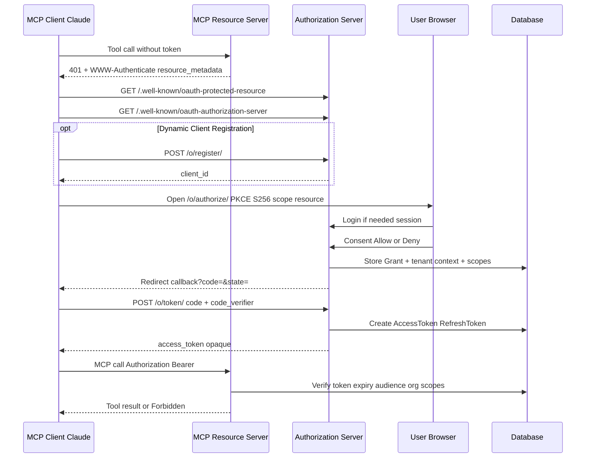

# MCP Authentication — Implementation Guide

A practical guide to implementing **OAuth-based authentication and authorization** for remote MCP servers (Claude Custom Connectors and other MCP clients).

This document is written so you can **reproduce the pattern in any project**. Where helpful, it points at this repo’s reference implementation (`retriever-mcp-demo`).

Related docs:

| Doc | Purpose |
|-----|---------|
| [README.md](README.md) | Setup, deploy, Claude connector how-to |
| [TECHNICAL.md](TECHNICAL.md) | How *this* codebase is wired end-to-end |

---

## Table of contents

1. [What you are building](#1-what-you-are-building)
2. [Roles and vocabulary](#2-roles-and-vocabulary)
3. [What not to do](#3-what-not-to-do)
4. [Standards you must implement](#4-standards-you-must-implement)
5. [Complete OAuth + MCP flow](#5-complete-oauth--mcp-flow)
6. [Step-by-step implementation checklist](#6-step-by-step-implementation-checklist)
7. [Authorization Server (AS) deep dive](#7-authorization-server-as-deep-dive)
8. [Resource Server (RS / MCP) deep dive](#8-resource-server-rs--mcp-deep-dive)
9. [Consent, org binding, and scopes](#9-consent-org-binding-and-scopes)
10. [Token verification algorithm](#10-token-verification-algorithm)
11. [Client registration (DCR vs static)](#11-client-registration-dcr-vs-static)
12. [Claude-specific requirements](#12-claude-specific-requirements)
13. [Serverless / production constraints](#13-serverless--production-constraints)
14. [Security checklist](#14-security-checklist)
15. [Testing strategy](#15-testing-strategy)
16. [Troubleshooting map](#16-troubleshooting-map)
17. [Minimal architecture you can copy](#17-minimal-architecture-you-can-copy)
18. [References](#18-references)

---

## 1. What you are building

You are not “adding a login to a chatbot.” You are building two cooperating servers:

1. **Authorization Server (AS)** — authenticates the *human*, shows consent, issues OAuth tokens.
2. **Resource Server (RS)** — hosts MCP tools; accepts only valid Bearer tokens.

The MCP client (e.g. Claude) is a third party. It must:

- discover how to get a token,
- send the user through your consent UI,
- call `/mcp` with `Authorization: Bearer <access_token>`.

```text
Human ──session──► Your website / consent (AS)
Claude ──Bearer──► Your /mcp tools (RS)
```

**Golden rule:** Website session cookies and MCP Bearer tokens are different credentials. Never treat one as the other.

---

## 2. Roles and vocabulary

| Term | Meaning |
|------|---------|
| **MCP client** | Claude (or another agent) that calls tools |
| **MCP server / RS** | Your FastMCP (or other) process at `/mcp` |
| **AS** | Your OAuth Authorization Server |
| **Resource** | Canonical MCP URL used as audience, e.g. `https://api.example.com/mcp` |
| **Scope** | Permission string, e.g. `inventory.devices.read` |
| **PKCE** | Proof Key for Code Exchange — stops auth-code interception |
| **Opaque token** | Random string stored in DB (not a self-contained JWT) |
| **DCR** | Dynamic Client Registration — client self-registers at runtime |
| **PRM** | Protected Resource Metadata (RFC 9728) |

### Authentication vs authorization

| Question | Layer | Typical mechanism |
|----------|--------|-------------------|
| Who is the human on consent? | AS | Session login (username/password, SSO, …) |
| May Claude call MCP at all? | RS | Valid, non-expired access token |
| May Claude call *this* tool? | RS | Scope check on the token |
| Which tenant’s data? | RS + your domain | Org/tenant bound at consent, not from tool args |

---

## 3. What not to do

| Anti-pattern | Why it fails |
|--------------|--------------|
| Shared API key for all Claude users | No per-user identity, no revoke, no tenant isolation |
| Trust `organization_id` from the model/tool args | Client can request another tenant’s data |
| JWT session cookie as MCP credential | Wrong channel; CSRF/session semantics ≠ Bearer |
| HTTP introspect from RS back to AS on every call (same host, serverless) | Cold starts, loops, timeouts |
| Skip PKCE | Auth codes can be stolen in redirect |
| Skip discovery / `WWW-Authenticate` challenge | Claude cannot find your AS |
| Put secrets in React `localStorage` | XSS steals them; consent/token stay server-side |

This demo deliberately uses **OAuth authorization code + PKCE**, not API keys.

---

## 4. Standards you must implement

| Spec | What to expose |
|------|----------------|
| [MCP Authorization](https://modelcontextprotocol.io/specification/2025-11-25/basic/authorization) | Overall client discovery + Bearer usage |
| [RFC 9728](https://www.rfc-editor.org/rfc/rfc9728) | `GET /.well-known/oauth-protected-resource` |
| [RFC 8414](https://www.rfc-editor.org/rfc/rfc8414) | `GET /.well-known/oauth-authorization-server` |
| [RFC 8707](https://www.rfc-editor.org/rfc/rfc8707) | `resource` / audience on tokens |
| [RFC 7636](https://www.rfc-editor.org/rfc/rfc7636) | PKCE (`S256`) |
| [RFC 7591](https://www.rfc-editor.org/rfc/rfc7591) | Optional DCR at `/o/register/` (Claude supports this) |
| OAuth 2.1 auth code | `/authorize`, `/token`, optional `/revoke` |

Minimum discovery document shapes:

**Protected Resource Metadata (simplified):**

```json
{
  "resource": "https://your-host/mcp",
  "authorization_servers": ["https://your-host"],
  "scopes_supported": ["app.read", "app.write"],
  "bearer_methods_supported": ["header"]
}
```

**Authorization Server Metadata (simplified):**

```json
{
  "issuer": "https://your-host",
  "authorization_endpoint": "https://your-host/o/authorize/",
  "token_endpoint": "https://your-host/o/token/",
  "registration_endpoint": "https://your-host/o/register/",
  "code_challenge_methods_supported": ["S256"],
  "scopes_supported": ["app.read", "app.write", "offline_access"]
}
```

**Unauthenticated MCP challenge:**

```http
HTTP/1.1 401 Unauthorized
WWW-Authenticate: Bearer resource_metadata="https://your-host/.well-known/oauth-protected-resource", scope="app.read app.write"
```

Reference in this repo: [`config/asgi.py`](config/asgi.py) (`ResourceMetadataChallengeMiddleware`).

---

## 5. Complete OAuth + MCP flow



### Timeline in plain English

1. Claude hits MCP → rejected → learns where metadata lives.  
2. Claude reads metadata → learns AS URL and scopes.  
3. Optional: Claude registers as an OAuth client (DCR).  
4. User’s browser opens your authorize URL with PKCE.  
5. User authenticates to *your* product (session).  
6. User consents; you bind **user + tenant + scopes**.  
7. Claude exchanges the code for an access token.  
8. Every tool call: verify token → check scope → run business logic for that tenant.

---

## 6. Step-by-step implementation checklist

Use this when adding MCP auth to a greenfield or existing app.

### Phase 0 — Decisions

- [ ] Canonical public HTTPS MCP URL (`MCP_RESOURCE_URL`)
- [ ] Whether AS and RS share one deploy (recommended for small apps) or are split
- [ ] Token type: opaque DB tokens (this demo) vs JWT
- [ ] Tenant model: org / workspace / account id bound at consent
- [ ] Scope vocabulary (`resource.action` style)

### Phase 1 — Authorization Server

- [ ] User login (session or SSO) required before consent
- [ ] `/o/authorize/` with PKCE required
- [ ] Branded consent UI (Allow / Deny)
- [ ] `/o/token/` issues access (+ refresh) tokens
- [ ] Persist token → user → scopes → **tenant**
- [ ] AS metadata endpoint
- [ ] Redirect URI allowlist (include Claude callbacks)

### Phase 2 — Resource Server (MCP)

- [ ] Mount MCP at public path (e.g. `/mcp`)
- [ ] Reject missing/invalid Bearer with `401` + `resource_metadata`
- [ ] PRM endpoint returns same resource URL Claude will use as audience
- [ ] Token verifier: exist, not expired, audience, tenant present
- [ ] Per-tool scope checks
- [ ] Ignore client-supplied tenant ids in tool arguments

### Phase 3 — Product UX

- [ ] Connected apps / revoke UI
- [ ] Optional: edit scopes without full reconnect
- [ ] Logout policy (this demo revokes all OAuth tokens on logout)

### Phase 4 — Hardening

- [ ] Short auth-code TTL (but long enough for cold starts, e.g. 300s)
- [ ] Rotate refresh tokens
- [ ] Hash client secrets at rest
- [ ] No tokens/secrets in frontend storage or logs
- [ ] HTTPS-only cookies in production

---

## 7. Authorization Server (AS) deep dive

### 7.1 Responsibilities

| Responsibility | Notes |
|----------------|-------|
| Authenticate human | Login before consent |
| Prove client identity | `client_id` (+ secret for confidential clients) |
| PKCE | Require `code_challenge_method=S256` |
| Issue codes/tokens | Store in DB if opaque |
| Advertise endpoints | RFC 8414 metadata |
| Bind domain context | Tenant/org at Allow time |

### 7.2 Consent is not optional UX fluff

Consent is where **authorization intent** is captured:

- Which client (Claude app registration)
- Which user
- Which scopes
- Which tenant (active organization in this demo)

Reference: `RetrieverAuthorizationView` in [`oauth_server/views.py`](oauth_server/views.py).

On Allow, create (or update) a context row such as `OAuthAuthorizationContext` linking grant/token → organization.

### 7.3 Preserving OAuth query params across login

Authorize URL carries `client_id`, `redirect_uri`, `scope`, `state`, `code_challenge`, `resource`.

If the user must log in first:

```text
/o/authorize/?…  →  302 /login/?next=/o/authorize/?…
```

After login, redirect back to `next`. Losing query params breaks PKCE/state and causes Claude “authorization failed” errors.

### 7.4 Auth code → token

Token endpoint must verify:

- code exists and is unused
- code not expired
- `redirect_uri` matches
- `code_verifier` satisfies PKCE challenge
- client authentication (or public client + PKCE)

Then issue:

- `access_token` (opaque string)
- `token_type=Bearer`
- `expires_in`
- `scope`
- optional `refresh_token`
- optional `resource` / audience binding

---

## 8. Resource Server (RS / MCP) deep dive

### 8.1 Mounting MCP beside your web app

This repo composes ASGI:

```text
/mcp/*     → FastMCP
/*         → Django (pages, OAuth, .well-known)
```

See [`config/asgi.py`](config/asgi.py).

FastMCP flags used for serverless:

```python
# Conceptual — see mcp_server/server.py
stateless_http=True
json_response=True
auth=YourTokenVerifier()
```

### 8.2 Wire a custom token verifier

Implement a verifier that returns a structured access token object with:

- `scopes: list[str]`
- `claims` including `user_id`, `organization_id` (tenant), `username`
- `expires_at`

Reference: `DjangoAccessTokenVerifier` in [`mcp_server/auth.py`](mcp_server/auth.py).

### 8.3 Tools enforce scopes

Pattern:

```python
def _auth_context():
    token = get_access_token()  # injected by FastMCP after verify
    if not token:
        raise ToolError("Unauthorized")
    claims = token.claims or {}
    return AuthContext(
        user_id=claims["user_id"],
        organization_id=claims["organization_id"],
        scopes=frozenset(token.scopes or []),
    )

def _require(ctx, scope: str):
    if scope not in ctx.scopes:
        raise ToolError(f"Forbidden: missing scope {scope}")

@mcp.tool()
def get_devices(organization_id: int | None = None):
    ctx = _auth_context()
    _require(ctx, "retriever.devices.read")
    _ = organization_id  # intentionally ignored
    return DeviceService.get_devices(organization_id=ctx.organization_id)
```

**Never** authorize off tool arguments for tenant or role.

---

## 9. Consent, org binding, and scopes

### 9.1 Why bind tenant at consent

If you only store `user_id` on the token, a user in many orgs is ambiguous. Binding **active org at consent** freezes the tenant for that Claude connection.

Flow in this demo:

1. Consent reads `UserProfile.active_organization`
2. Saves it on `OAuthAuthorizationContext`
3. When access token is created, a signal links context → token
4. Verifier copies `organization_id` into claims

### 9.2 Scope design tips

Prefer stable, coarse scopes:

```text
{product}.{resource}.{action}
retriever.devices.read
retriever.devices.write
retriever.orders.read
retriever.orders.write
```

| Guideline | Reason |
|-----------|--------|
| Separate read/write | Least privilege; Connected Apps can revoke write only |
| Keep list small | Consent UI stays understandable |
| Default to read-only | Safer first connect |
| Document tool ↔ scope map | Operators and Claude prompts stay aligned |

### 9.3 Changing permissions later

Options:

1. **Reconnect** (new consent)  
2. **Update live token scopes** (this demo’s Connected Apps “Save permissions”)  
3. **Revoke** (Disconnect / logout policy)

Live scope updates only work if the RS reads scopes from the DB on each request (opaque tokens) — which this design does.

---

## 10. Token verification algorithm

Implement exactly this order (fail closed):

```text
1. Extract Bearer token from Authorization header
2. Lookup token in store
3. If missing → reject
4. If expired → reject
5. If audience/resource required:
     - token.resource must include MCP_RESOURCE_URL
     - else reject (when MCP_REQUIRE_AUDIENCE=true)
6. Resolve tenant context for this token
7. If no tenant → reject
8. Attach claims: user_id, organization_id, scopes, client
9. Accept → tool layer runs scope checks
```

Pseudo-code aligned with this repo:

```python
def verify(token: str) -> VerifiedToken | None:
    row = AccessToken.objects.filter(token=token).select_related("user", "application").first()
    if row is None or row.is_expired():
        return None

    expected = settings.MCP_RESOURCE_URL.rstrip("/")
    audiences = normalize_resource(row.resource)
    if audiences and expected not in audiences:
        return None
    if not audiences and settings.MCP_REQUIRE_AUDIENCE:
        return None

    ctx = OAuthAuthorizationContext.objects.filter(access_token=row).first()
    org_id = ctx.organization_id if ctx else fallback_active_org(row.user)
    if org_id is None:
        return None

    return VerifiedToken(
        scopes=row.scope.split(),
        claims={
            "user_id": row.user_id,
            "organization_id": org_id,
            "username": row.user.get_username(),
            "oauth_client": row.application.name,
        },
    )
```

---

## 11. Client registration (DCR vs static)

| Mode | When to use | Claude UI |
|------|-------------|-----------|
| **DCR** | Fastest for demos; Claude creates `client_id` | “Register automatically” |
| **Static confidential** | You pre-create client + secret | “Use your own OAuth client” |
| **CIMD** | Claude’s published client metadata | Only if your AS supports it (this demo does **not**) |

### DCR tips

- Accept Claude redirect URIs:
  - `https://claude.ai/api/mcp/auth_callback`
  - `https://claude.com/api/mcp/auth_callback`
- For `token_endpoint_auth_method=none`, register a **public** client
- Always allowlist redirects; never reflect arbitrary URIs

### Static client tips

- Store hashed secrets
- Print raw secret **once** at creation
- Confidential clients need secret in Claude Advanced settings

---

## 12. Claude-specific requirements

| Requirement | Detail |
|-------------|--------|
| MCP URL | HTTPS, Streamable HTTP (not legacy SSE unless required) |
| Redirect URI | `https://claude.ai/api/mcp/auth_callback` (+ `claude.com` variant) |
| PKCE | S256 |
| Discovery | PRM + AS metadata must be public |
| Auth code redirect | Prefer HTTP **302/303** (not 307) on authorize success |
| Timeouts | Cold starts can break consent; warm the app; auth code TTL ≥ a few minutes |
| Connector modes | Prefer DCR unless you manage secrets carefully |

After website logout in this demo, tokens are revoked → Claude must reconnect. Document that product decision clearly.

---

## 13. Serverless / production constraints

| Constraint | Mitigation used here |
|------------|----------------------|
| No sticky process memory | `stateless_http=True` |
| SSE unreliable | `json_response=True` |
| Function timeout | Keep OAuth/MCP under budget; `maxDuration` (e.g. 60s) |
| Ephemeral disk | All OAuth/state in Postgres |
| Cold start + short auth codes | Raise `AUTHORIZATION_CODE_EXPIRE_SECONDS` (e.g. 300) |
| Self-HTTP introspect fragile | In-process ORM verify |
| Wrong public URL in metadata | Set `PUBLIC_BASE_URL` / `MCP_RESOURCE_URL` or derive from platform env |

**Database URL footgun:** on hosted dashboards, paste connection strings **without** wrapping quotes, or your ORM may treat the whole URI as the database name.

---

## 14. Security checklist

Copy into your PR template:

- [ ] PKCE S256 required  
- [ ] Redirect URIs allowlisted  
- [ ] Auth codes single-use and short-lived  
- [ ] Access tokens expire; refresh optional + rotated  
- [ ] Client secrets hashed  
- [ ] Scopes checked on every mutating/reading tool  
- [ ] Tenant taken from token context only  
- [ ] Revoke path (disconnect and/or logout)  
- [ ] CSRF on browser POSTs (login, consent, settings)  
- [ ] Secure cookies when `DEBUG=false`  
- [ ] No secrets in logs / client JS storage  
- [ ] Audience validation for production  
- [ ] Error messages do not leak token values  

---

## 15. Testing strategy

| Layer | What to assert |
|-------|----------------|
| Discovery | PRM/AS JSON shape; resource URL is HTTPS prod host |
| Authorize | Login required; invalid redirect rejected; PKCE required |
| Consent Allow | Code issued; Deny → `access_denied` |
| Token | Happy path; reused code fails; bad verifier fails |
| MCP unauth | `401` + `resource_metadata` header |
| MCP auth | Valid token → tool works |
| Scopes | Missing write scope → Forbidden |
| Tenant | Org A token cannot read Org B rows |
| Revoke | After disconnect/logout, verify returns null |

Reference tests: `oauth_server/tests.py`, `mcp_server/tests.py`, `tests/test_mcp_asgi.py`.

---

## 16. Troubleshooting map

| Symptom | Likely cause |
|---------|----------------|
| Claude “couldn’t reach MCP” | Not public HTTPS; wrong URL; firewall |
| Auth fails immediately | Bad client id/secret; CIMD selected but unsupported |
| Consent never shows | Login `next=` lost; user not completing browser login |
| Consent slow then Claude error | Cold start; auth code expired; use longer TTL + warm URL |
| `invalid_grant` | Code reused/expired; PKCE mismatch |
| Tools listed but calls fail | Missing scopes; edit Connected Apps or reconnect |
| Wrong/empty data | Org not bound at consent; wrong active org |
| Works until website logout | Expected if logout revokes tokens |
| `NAME` longer than 63 chars (Postgres) | Quoted `DATABASE_URL` treated as DB name |

---

## 17. Minimal architecture you can copy

Suggested package split (mirrors this repo):

```text
your_project/
  config/asgi.py          # Mount MCP + web
  oauth_as/               # Metadata, consent, DCR, revoke UX
  mcp_rs/                 # FastMCP app, TokenVerifier, tools
  domain/                 # Services + models (tenant-aware)
  accounts/               # Human login/session
```

### Responsibility boundaries

```text
accounts     → authenticates humans (session)
oauth_as     → issues tokens after consent
mcp_rs       → verifies tokens + enforces scopes
domain       → business rules + tenant filters
```

### Env vars you will almost always need

```bash
PUBLIC_BASE_URL=https://your-host
MCP_RESOURCE_URL=https://your-host/mcp
DATABASE_URL=postgresql://…
SECRET_KEY=…
DEBUG=false
CSRF_TRUSTED_ORIGINS=https://your-host
ALLOWED_HOSTS=your-host
AUTHORIZATION_CODE_EXPIRE_SECONDS=300
MCP_REQUIRE_AUDIENCE=true   # recommended in production
```

### Reference map in this repository

| Concern | File |
|---------|------|
| ASGI mount + 401 challenge | [`config/asgi.py`](config/asgi.py) |
| AS metadata + consent + DCR | [`oauth_server/views.py`](oauth_server/views.py) |
| Org binding on token create | [`oauth_server/signals.py`](oauth_server/signals.py) |
| Token verifier | [`mcp_server/auth.py`](mcp_server/auth.py) |
| Tools + scope gates | [`mcp_server/tools.py`](mcp_server/tools.py) |
| FastMCP construction | [`mcp_server/server.py`](mcp_server/server.py) |
| Domain services | [`retriever/services/__init__.py`](retriever/services/__init__.py) |
| OAuth settings | [`config/settings.py`](config/settings.py) |

---

## 18. References

- [MCP Authorization (2025-11-25)](https://modelcontextprotocol.io/specification/2025-11-25/basic/authorization)
- [MCP Transports — Streamable HTTP](https://modelcontextprotocol.io/specification/2025-11-25/basic/transports)
- [Claude: Authentication for connectors](https://claude.com/docs/connectors/building/authentication)
- [Claude: Custom connectors (remote MCP)](https://support.claude.com/en/articles/11175166-get-started-with-custom-connectors-using-remote-mcp)
- [FastMCP Authentication](https://gofastmcp.com/servers/auth/authentication)
- [FastMCP Token Verification](https://gofastmcp.com/servers/auth/token-verification)
- [django-oauth-toolkit](https://django-oauth-toolkit.readthedocs.io/)
- [RFC 9728 Protected Resource Metadata](https://www.rfc-editor.org/rfc/rfc9728)
- [RFC 8414 Authorization Server Metadata](https://www.rfc-editor.org/rfc/rfc8414)
- [RFC 8707 Resource Indicators](https://www.rfc-editor.org/rfc/rfc8707)
- [RFC 7591 Dynamic Client Registration](https://www.rfc-editor.org/rfc/rfc7591)
- [RFC 7636 PKCE](https://www.rfc-editor.org/rfc/rfc7636)

---

## One-page summary

```text
1. MCP without token → 401 + resource_metadata URL
2. Client reads PRM + AS metadata
3. User logs into YOUR app and consents (PKCE)
4. You bind user + tenant + scopes to the grant/token
5. Client exchanges code for opaque access token
6. Each tool call: verify token → check scope → use token tenant only
7. Provide revoke / scope-edit / logout policy for real-world control
```

If you follow that sequence and the security checklist, you have a production-shaped MCP authentication design — the same one this repository demonstrates.

*Keep this document updated when you change consent, scopes, or token verification behavior.*
